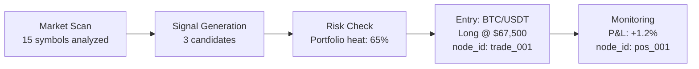

# TencentDB Agent Memory × TSAR Integration Analysis

**Council:** Integration Review  
**Date:** 2026-07-30  
**Repository:** https://github.com/TencentCloud/TencentDB-Agent-Memory  
**Version Analyzed:** v0.3.6  
**Verdict:** ⚡ **STRONG COMPLEMENTARY FIT — Adopt the memory layering paradigm, selectively integrate components**

---

## 1. Executive Summary

TencentDB Agent Memory (TDB-AM) is a **layered memory system for conversational agents** built by Tencent Cloud. It solves a fundamentally different problem than TSAR's knowledge stores — it manages *agent conversational memory and user personalization*, while TSAR manages *trading domain knowledge*. However, the **architectural patterns** TDB-AM introduces are directly applicable to TSAR and address several of TSAR's most critical gaps:

| TSAR Gap | TDB-AM Solution | Impact |
|---|---|---|
| Flat knowledge retrieval | 4-layer semantic pyramid (L0→L3) | **Context-efficient recall** |
| No memory consolidation | LLM-driven extraction pipeline | **Auto-distillation** |
| Keyword-only search | Hybrid BM25 + Vector + RRF fusion | **Semantic pattern matching** |
| No context compression | Mermaid symbolic memory + offloading | **Token savings up to 61%** |
| No user/agent profiling | L3 Persona generation | **Agent self-awareness** |
| No drill-down traceability | node_id linked drill-down chain | **Full audit trail** |

**Bottom Line:** TDB-AM's memory layering paradigm is the missing architectural pattern for TSAR's knowledge stores. Rather than replacing TSAR's existing SQLite + FTS5 + ChromaDB stack, TDB-AM's patterns should be *grafted onto* it to create a hierarchical, self-consolidating trading memory system.

---

## 2. TencentDB Agent Memory Architecture Deep Dive

### 2.1 Core Philosophy

> "Memory is not about hoarding everything — it is about sparing humans from having to repeat themselves."

TDB-AM rejects two extremes:
1. **Brute-force history accumulation** (dump everything into context)
2. **Irreversible lossy summarization** (compress and lose evidence)

Instead, it implements **layered memory with progressive disclosure** — upper layers carry judgment and structure, lower layers carry evidence and precision.

### 2.2 The Four-Layer Memory Model

```
┌─────────────────────────────────────────────────────┐
│ L3 Persona ─── User/agent profile (Markdown)        │  ← Stable, rarely changes
├─────────────────────────────────────────────────────┤
│ L2 Scenario ── Scene blocks (Markdown files)         │  ← Changes per topic/session
├─────────────────────────────────────────────────────┤
│ L1 Atom ────── Structured facts (SQLite + vec0)      │  ← Extracted every N turns
├─────────────────────────────────────────────────────┤
│ L0 Conversation ─ Raw messages (SQLite + vec0 + FTS5)│  ← Every message captured
└─────────────────────────────────────────────────────┘
```

**Key insight:** Each layer is stored in a different format optimized for its role:
- **L0/L1**: Database (SQLite + sqlite-vec for vectors, FTS5 for keyword search)
- **L2/L3**: Human-readable Markdown files (white-box, inspectable)

### 2.3 Storage Architecture

| Component | Technology | Purpose |
|---|---|---|
| Metadata store | SQLite (WAL mode) | L0 conversations, L1 memory records |
| Vector store | sqlite-vec (vec0 virtual table) | Cosine similarity search |
| Full-text search | FTS5 (BM25) | Keyword search with jieba segmentation |
| Hybrid search | RRF (Reciprocal Rank Fusion) | Merges vector + keyword results |
| File store | Markdown files | L2 scene blocks, L3 persona |
| Embedding | OpenAI-compatible API or local node-llama-cpp | Text → vector conversion |

### 2.4 Memory Pipeline

```
Conversation → L0 Capture → L1 Extraction (every N turns) → L2 Scene Aggregation → L3 Persona Generation
     ↓              ↓                    ↓                          ↓                        ↓
  Raw messages  SQLite+FTS5+vec    Structured facts          Scene blocks              User profile
                                   (persona/episodic/         (Markdown)               (Markdown)
                                    instruction)
```

**Pipeline triggers:**
- L0 capture: Every conversation turn
- L1 extraction: Every 5 turns OR after 600s idle
- L2 scene aggregation: After L1 extraction
- L3 persona generation: Every 50 new L1 memories

### 2.5 Retrieval Architecture

```
User Query → sanitizeText() → Strategy Router
                                  ├── keyword: FTS5 BM25 search
                                  ├── embedding: VectorStore cosine similarity
                                  └── hybrid: keyword + embedding → RRF merge
                                         ↓
                              Top-K results → formatMemoryLine() → Inject into context
```

**Recall features:**
- Configurable strategy (keyword / embedding / hybrid)
- Score threshold filtering (default 0.3)
- Per-memory character budget (`maxCharsPerMemory`)
- Total recall character budget (`maxTotalRecallChars`)
- Timeout protection (default 5s, skips injection on timeout)
- Context split: stable persona → system prompt (cacheable), dynamic memories → user prompt

### 2.6 Short-Term Context Compression (Symbolic Memory)

For long-running tasks, TDB-AM compresses context through:

1. **Offload:** Verbose tool logs → external files (`refs/*.md`)
2. **Summarize:** Step-level summaries → JSONL
3. **Symbolize:** Task state → Mermaid graph (high-density, few tokens)
4. **Trace:** `node_id` links enable drill-down from symbol to raw text

**Result:** Up to 61% token reduction with 51% relative improvement in task success.

---

## 3. Mapping to TSAR's Five Knowledge Stores

### 3.1 Current TSAR Architecture

TSAR has 5 knowledge stores, all in SQLite with FTS5:

| Store | Data | Search | Gap |
|---|---|---|---|
| **Trade Memory** | Every trade with context | FTS5 keyword | No semantic search, no consolidation |
| **Strategy Genomes** | Evolving parameters | Key lookup | No lineage tracking via memory |
| **Regime State** | Market regime probabilities | Key lookup | No historical regime memory |
| **Pattern Library** | Discovered patterns | FTS5 keyword | No cross-temporal pattern matching |
| **Lesson Archive** | Distilled wisdom | FTS5 keyword | No auto-distillation pipeline |

### 3.2 TDB-AM Patterns Applicable to Each Store

#### Trade Memory → L0/L1 Model

**Current:** Flat `trade_records` table with FTS5 keyword search on `thesis`, `reflection` fields.

**TDB-AM Enhancement:**
- **L0 layer:** Every raw trade signal, market snapshot, order book state → captured as L0 conversation equivalents
- **L1 layer:** Extract structured trade memories (entry thesis, exit rationale, market context) via LLM extraction
- **L2 layer:** Group trades into scenario blocks ("BTC momentum trades in Q1", "Mean-reversion during high-vol")
- **L3 layer:** Trade persona — "This agent performs best in trending markets with VIX < 20"

**Concrete benefit:** When evaluating a new trade signal, the agent can recall not just similar trades (keyword match) but *semantically similar situations* (vector search) — "last time the market structure looked like this, with this regime and this sector momentum, the outcome was..."

#### Pattern Library → L2 Scene Blocks

**Current:** Patterns stored as flat records with FTS5 search.

**TDB-AM Enhancement:**
- Patterns become L2 scene blocks — Markdown files with full context
- Each pattern block includes: description, conditions, example trades, statistical validation
- Scene navigation provides a browsable index of all patterns
- LLM-driven scene extraction automatically groups related patterns

**Concrete benefit:** Instead of searching for "head and shoulders pattern" via keywords, the agent navigates through scene blocks: "reversal patterns in crypto" → "head and shoulders with volume divergence" → drill down to specific examples.

#### Lesson Archive → L1 Atom + Auto-Consolidation

**Current:** Lessons manually created, FTS5 searchable.

**TDB-AM Enhancement:**
- Lessons are L1 atoms extracted automatically from trade history
- L1 dedup pipeline prevents redundant lessons
- LLM extraction identifies lessons from trade outcomes
- Priority scoring ensures critical lessons surface first
- Scene grouping creates "lesson themes" (e.g., "risk management lessons", "entry timing lessons")

**Concrete benefit:** Instead of waiting for manual lesson creation, the system automatically extracts lessons from every trade batch: "User exited too early on 3 consecutive momentum trades → lesson: hold winners until regime shift signal."

#### Strategy Genomes → Metadata + Lineage

**Current:** Strategy parameters stored as JSON, no memory of mutations.

**TDB-AM Enhancement:**
- Each genome mutation becomes an L1 episodic memory
- Genome evolution history is searchable via vector similarity
- "When did we last adjust the momentum lookback? Why?" → instant recall
- Strategy persona (L3) captures the strategy's "personality" over time

#### Regime State → L0 Temporal Index

**Current:** Current regime probabilities only, no historical memory.

**TDB-AM Enhancement:**
- Every regime transition becomes an L0 record with full context
- Historical regime sequences are vector-searchable
- "What happened last time we transitioned from ranging to trending?" → semantic recall
- Regime scene blocks (L2) capture regime-specific trading patterns

---

## 4. Specific Integration Applications

### 4.1 Semantic Trade Retrieval

**Problem:** TSAR's `TradeMemory.search()` uses FTS5 keyword matching. It can find trades mentioning "momentum" but can't find trades where the *market structure was similar*.

**TDB-AM Solution:** Add sqlite-vec vector table alongside existing FTS5.

```python
# Current TSAR (keyword only)
results = trade_memory.search("momentum breakout", limit=5)

# Enhanced TSAR (hybrid: keyword + vector + RRF)
results = trade_memory.hybrid_search(
    query="momentum breakout with increasing volume in trending regime",
    strategy="hybrid",  # keyword + embedding → RRF merge
    limit=5,
    score_threshold=0.3
)
```

**Implementation:**
1. Add `sqlite-vec` extension to TSAR's SQLite database
2. Create `vec0` virtual tables for trade embeddings
3. Add embedding service (OpenAI-compatible API or local model)
4. Implement RRF merge in `trade_memory.py`
5. Embed trade thesis + context on write, search on read

**Effort:** ~2-3 days (TDB-AM's `sqlite.ts` is a direct reference implementation)

### 4.2 Automatic Lesson Distillation

**Problem:** TSAR's `LessonArchive` requires manual lesson creation. Lessons are only created when the shadow agent explicitly writes them.

**TDB-AM Solution:** L1 extraction pipeline automatically distills lessons from trade history.

```
Trade batch (L0) → LLM extraction → Structured lessons (L1) → Dedup → Store
```

**Implementation:**
1. Adapt TDB-AM's `l1-extraction.ts` prompt for trading domain
2. Create `LessonExtractor` class that processes trade batches
3. Extract lessons as structured records: {content, type, priority, source_trade_ids}
4. Use TDB-AM's dedup pipeline to prevent redundant lessons
5. Trigger extraction every N trades or after significant events

**Extraction prompt (trading-adapted):**
```
You are a trading lesson extraction expert. Analyze the following trades and extract:
1. Pattern lessons (type: "pattern") — recurring setups and their outcomes
2. Risk lessons (type: "risk") — risk management successes/failures
3. Execution lessons (type: "execution") — entry/exit timing insights
4. Regime lessons (type: "regime") — how market regimes affected outcomes

Each lesson must be independent and understandable without context.
Priority: 80-100 (critical), 50-70 (useful), <50 (discard).
```

**Effort:** ~3-4 days

### 4.3 Pattern Memory with Temporal Context

**Problem:** TSAR's patterns are static. There's no way to ask "show me patterns similar to what I'm seeing now, across all of history."

**TDB-AM Solution:** Vector-indexed pattern library with temporal metadata.

**Implementation:**
1. Embed pattern descriptions + conditions into sqlite-vec
2. Store pattern observations with timestamp vectors
3. Enable semantic search: "find patterns similar to current market structure"
4. Add temporal filtering: "show me this pattern type in the last 30 days"
5. Use scene blocks (L2) to group related patterns into navigable themes

**Effort:** ~2 days

### 4.4 Regime Transition Memory

**Problem:** TSAR tracks current regime probabilities but doesn't remember what happened during previous transitions.

**TDB-AM Solution:** L0 temporal index of regime transitions with outcome tracking.

**Implementation:**
1. Record every regime transition as an L0 event with full market context
2. Embed transition context for semantic search
3. On regime change, auto-recall similar historical transitions
4. Track outcomes of each transition (P&L, duration, drawdown)

**Effort:** ~1-2 days

### 4.5 Context Compression for Long Trading Sessions

**Problem:** TSAR's agent context grows unbounded during long trading sessions, consuming tokens and degrading performance.

**TDB-AM Solution:** Mermaid symbolic memory + context offloading.

**Implementation:**
1. After each trading decision cycle, compress verbose analysis into Mermaid graph
2. Offload detailed market data, order book snapshots to external files
3. Keep only the symbolic task map in context
4. Use `node_id` for drill-down when details are needed

**Example compressed trading context:**


**Effort:** ~3-5 days

---

## 5. Integration Architecture

### 5.1 Recommended Approach: Complement, Not Replace

TDB-AM should **not** replace TSAR's existing knowledge stores. Instead:

```
┌─────────────────────────────────────────────────────────────────┐
│                    TSAR Trading Superagent                       │
├─────────────────────────────────────────────────────────────────┤
│  Existing Stack (Keep)          │  TDB-AM Enhancements (Add)    │
│  ─────────────────────────────  │  ───────────────────────────  │
│  SQLite + FTS5 (trade records)  │  + sqlite-vec (vector search) │
│  ChromaDB (embeddings)          │  + RRF hybrid search          │
│  Knowledge Graph                │  + L1 extraction pipeline     │
│  Rule Validator                 │  + L2 scene blocks            │
│                                 │  + L3 agent persona           │
│                                 │  + Context compression        │
│                                 │  + Auto-consolidation         │
└─────────────────────────────────────────────────────────────────┘
```

### 5.2 Component Mapping

| TDB-AM Component | TSAR Adaptation | Integration Point |
|---|---|---|
| `SqliteMemoryStore` | Extend `trade_memory.py` | Add vec0 tables, hybrid search |
| `EmbeddingService` | New `knowledge/embedding.py` | Shared embedding for all stores |
| L1 Extraction Pipeline | New `knowledge/auto_extractor.py` | Trade → lesson distillation |
| Scene Extractor | Adapt for pattern grouping | Pattern Library enhancement |
| Persona Generator | Adapt for agent self-awareness | New L3 agent profile |
| Hybrid Search (RRF) | Extend `fts_search.py` | All knowledge store searches |
| Context Offload | New `utils/context_compressor.py` | Long session management |
| Mermaid Canvas | New `utils/symbolic_memory.py` | Trading task state tracking |

### 5.3 Integration Phases

#### Phase 1: Hybrid Search (Week 1)
- Add sqlite-vec to TSAR's SQLite database
- Implement RRF merge in search layer
- Add embedding service (OpenAI API or local model)
- Enable hybrid search for Trade Memory and Pattern Library

#### Phase 2: Auto-Consolidation (Week 2)
- Port L1 extraction prompt for trading domain
- Implement lesson auto-extraction from trade batches
- Add L1 dedup pipeline for lessons and patterns
- Trigger extraction on trade batch completion

#### Phase 3: Memory Layering (Week 3)
- Implement L2 scene blocks for patterns and lessons
- Add scene navigation (browsable index)
- Implement L3 agent persona generation
- Add drill-down traceability (scene → atom → raw trade)

#### Phase 4: Context Compression (Week 4)
- Implement Mermaid symbolic memory for trading sessions
- Add context offloading for verbose analysis
- Implement `node_id` drill-down for compressed context
- Add token budget management

---

## 6. Technical Feasibility Assessment

### 6.1 Compatibility

| Aspect | TSAR | TDB-AM | Compatible? |
|---|---|---|---|
| Language | Python | TypeScript/Node.js | ⚠️ Need Python port |
| Database | SQLite + FTS5 | SQLite + sqlite-vec + FTS5 | ✅ Same stack |
| Embeddings | ChromaDB | sqlite-vec / TCVDB | ✅ sqlite-vec is lighter |
| Search | FTS5 only | BM25 + Vector + RRF | ✅ Enhancement |
| Storage | SQLite tables | SQLite + Markdown files | ✅ Both |

### 6.2 Key Porting Requirements

**Must port to Python:**
1. `sqlite-vec` integration (Python bindings exist: `sqlite-vec` package)
2. RRF merge algorithm (~50 lines)
3. L1 extraction prompt + pipeline
4. Scene block management
5. Persona generation

**Can reference directly:**
1. Schema design (L0/L1 tables, vec0 virtual tables)
2. Extraction prompts (translate to trading domain)
3. Search strategies (hybrid, threshold, budget)
4. Context compression patterns

### 6.3 Dependencies

| Dependency | Required? | Notes |
|---|---|---|
| sqlite-vec | Yes | Python package available |
| Embedding API | Yes | Can use existing ChromaDB embeddings |
| node-llama-cpp | No | TSAR can use remote API |
| jieba | Optional | For Chinese market analysis |
| Mermaid | Optional | For context compression |

---

## 7. Competitive Advantage Analysis

### 7.1 vs. TSAR's Current Memory System

| Capability | TSAR Current | With TDB-AM Patterns | Advantage |
|---|---|---|---|
| Search quality | Keyword only (FTS5) | Hybrid (keyword + vector + RRF) | **Semantic understanding** |
| Memory organization | Flat tables | 4-layer pyramid | **Progressive disclosure** |
| Lesson creation | Manual | Auto-extracted | **Zero-effort distillation** |
| Pattern discovery | Manual | LLM-driven scene extraction | **Automatic grouping** |
| Context management | Unbounded growth | Compressed + offloaded | **61% token savings** |
| Traceability | Direct lookup | Drill-down chain | **Full audit trail** |
| Agent self-awareness | None | L3 persona | **Adaptive behavior** |

### 7.2 Jensen's "Flywheel Compounds Forever"

TDB-AM's layering paradigm directly enables TSAR's flywheel:

```
Trade Execution → L0 Capture → L1 Extraction → L2 Scene → L3 Persona
       ↑                                                        │
       └────────── Better decisions from richer memory ─────────┘
```

Each layer compounds over time:
- **L0:** Raw evidence accumulates (every trade, every signal)
- **L1:** Structured knowledge grows (lessons, patterns, insights)
- **L2:** Thematic understanding deepens (scene blocks group related knowledge)
- **L3:** Agent wisdom emerges (persona captures what works and what doesn't)

This is the "memory that gets smarter with every trade" that Jensen described. The agent doesn't just remember trades — it *understands* them at progressively deeper levels.

### 7.3 Unique Capabilities TDB-AM Adds

1. **Semantic Pattern Matching:** Find similar market situations across all of history, not just keyword matches
2. **Auto-Consolidation:** The system distills its own lessons without human intervention
3. **Progressive Disclosure:** Start with high-level understanding, drill down to evidence when needed
4. **Context Compression:** Maintain awareness of long trading sessions without token explosion
5. **White-Box Memory:** Every memory artifact is inspectable — Markdown files, not black-box vectors

---

## 8. Risk Assessment

| Risk | Severity | Mitigation |
|---|---|---|
| Python porting effort | Medium | Core algorithms are simple; schema is reference |
| Embedding cost | Low | Can use local models or batch embedding |
| LLM extraction quality | Medium | Domain-specific prompts, human validation loop |
| sqlite-vec stability | Low | Alpha but widely used; fallback to ChromaDB |
| Over-extraction (noise) | Medium | Priority thresholds, dedup pipeline |
| Context compression accuracy | Medium | node_id drill-down preserves full evidence |

---

## 9. Implementation Effort Summary

| Component | Effort | Priority | Impact |
|---|---|---|---|
| sqlite-vec integration | 1-2 days | P0 | Enables vector search |
| Hybrid search (RRF) | 1-2 days | P0 | Semantic recall |
| L1 extraction pipeline | 3-4 days | P1 | Auto-consolidation |
| Scene blocks (L2) | 2-3 days | P1 | Pattern grouping |
| Agent persona (L3) | 2-3 days | P2 | Self-awareness |
| Context compression | 3-5 days | P2 | Token savings |
| **Total** | **12-19 days** | | |

---

## 10. Verdict

### What TDB-AM Is
A **production-grade memory layering system** for conversational agents, proven to reduce tokens by 61% and improve task success by 51%. It uses SQLite + sqlite-vec + FTS5 with hybrid RRF search, LLM-driven extraction, and progressive disclosure.

### What TDB-AM Is Not
A trading-specific system. It has no domain knowledge about markets, trades, or strategies. It's a *memory infrastructure* that needs domain adaptation.

### The Fit
TDB-AM's **architectural patterns** are exactly what TSAR's knowledge stores need:
- **Layered memory** replaces flat table queries
- **Hybrid search** replaces keyword-only FTS5
- **Auto-consolidation** replaces manual lesson creation
- **Context compression** solves the long-session token problem
- **Drill-down traceability** maintains full audit trail

### Recommendation

**ADOPT THE PARADIGM, PORT THE PATTERNS.**

1. **Immediate (Week 1):** Add sqlite-vec + hybrid search to Trade Memory and Pattern Library
2. **Short-term (Week 2-3):** Implement L1 auto-extraction for lessons and patterns
3. **Medium-term (Week 3-4):** Add L2 scene blocks and L3 agent persona
4. **Long-term (Month 2):** Implement context compression and symbolic memory

This is not a "plug and play" integration — it's an architectural upgrade. But the patterns are proven, the code is open-source, and the compounding effect on TSAR's flywheel is transformative.

---

## Appendix A: Key TDB-AM Source Files for Reference

| File | Purpose | TSAR Application |
|---|---|---|
| `src/core/store/sqlite.ts` | SQLite + sqlite-vec + FTS5 store | Direct reference for Python port |
| `src/core/store/types.ts` | Store interface + capability flags | Design pattern for TSAR stores |
| `src/core/hooks/auto-recall.ts` | Hybrid search + RRF + recall | Core search algorithm |
| `src/core/prompts/l1-extraction.ts` | Memory extraction prompt | Template for trading extraction |
| `src/core/record/l1-writer.ts` | Memory write + dedup | Write pipeline pattern |
| `src/core/scene/scene-extractor.ts` | LLM-driven scene grouping | Pattern grouping reference |
| `src/core/persona/persona-generator.ts` | L3 persona generation | Agent self-awareness |
| `src/offload/` | Context compression | Token savings reference |

## Appendix B: TDB-AM Performance Benchmarks

| Metric | Baseline | With TDB-AM | Improvement |
|---|---|---|---|
| WideSearch pass rate | 33% | 50% | +51.52% |
| SWE-bench pass rate | 58.4% | 64.2% | +9.93% |
| WideSearch tokens | 221.31M | 85.64M | -61.38% |
| SWE-bench tokens | 3474.1M | 2375.4M | -33.09% |
| PersonaMem accuracy | 48% | 76% | +59% |

These benchmarks validate the layering paradigm. While TSAR's domain is different, the *information overload* problem is identical — long trading sessions generate massive context that must be compressed without losing evidence.

## Appendix C: Hybrid Search RRF Algorithm

```python
# Reciprocal Rank Fusion (RRF) — merge keyword + vector results
# k=60 is the standard constant from the RRF paper

def hybrid_search_rrf(
    keyword_results: list[dict],  # sorted by BM25 score
    vector_results: list[dict],   # sorted by cosine similarity
    k: int = 60,
    max_results: int = 5,
) -> list[dict]:
    merged: dict[str, float] = {}
    record_map: dict[str, dict] = {}
    
    for rank, r in enumerate(keyword_results):
        rid = r["record_id"]
        merged[rid] = merged.get(rid, 0) + 1 / (k + rank + 1)
        record_map[rid] = r
    
    for rank, r in enumerate(vector_results):
        rid = r["record_id"]
        merged[rid] = merged.get(rid, 0) + 1 / (k + rank + 1)
        record_map[rid] = record_map.get(rid, r)
    
    sorted_ids = sorted(merged, key=lambda x: merged[x], reverse=True)
    return [record_map[rid] for rid in sorted_ids[:max_results]]
```

---

*Analysis complete. TDB-AM's memory layering paradigm is the architectural upgrade TSAR needs to achieve truly compounding trading intelligence.*
